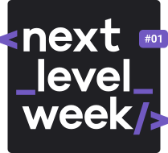
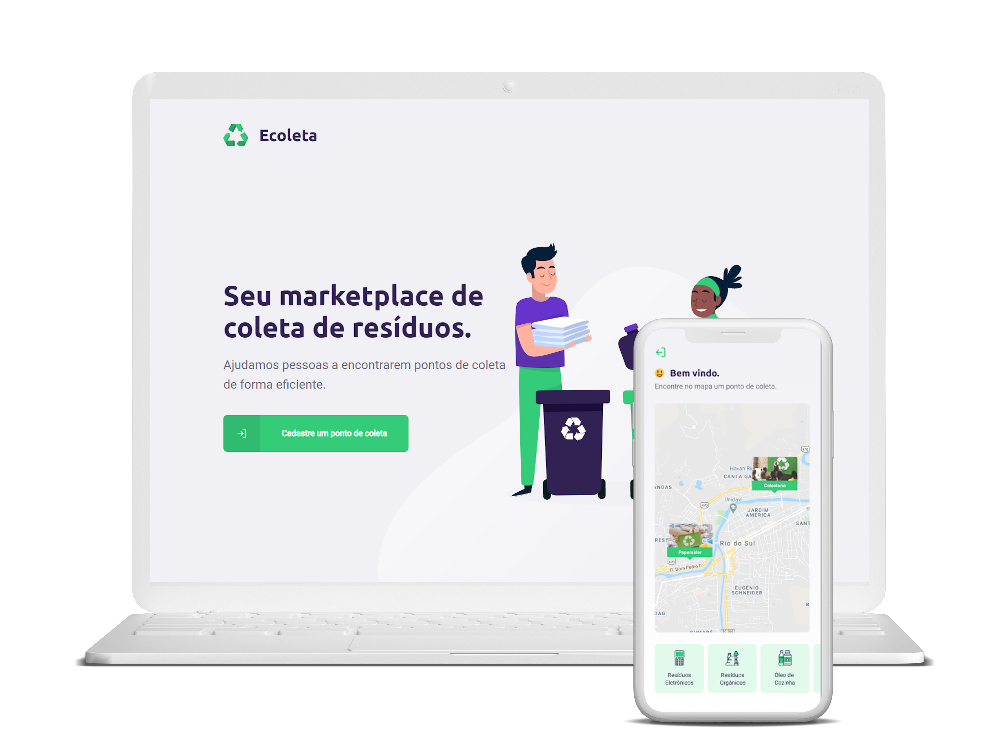

<h1 align="center">
  
</h1>
<h1 align="center">
  
</h1>

<p align="center">
  <a href="#-technologies">Technologies</a>&nbsp;&nbsp;&nbsp;|&nbsp;&nbsp;&nbsp;
  <a href="#-project">Project</a>&nbsp;&nbsp;&nbsp;|&nbsp;&nbsp;&nbsp;
  <a href="#-layout">Layout</a>&nbsp;&nbsp;&nbsp;|&nbsp;&nbsp;&nbsp;
  <a href="#how-to-run-it">How to run it</a>&nbsp;&nbsp;&nbsp;
</p>


<br>

<p align="center">
  
</p>

## 🚀 Technologies

This project was developed with the following technologies:

- [Node.js](https://nodejs.org/en/)
- [React](https://reactjs.org)
- [React Native](https://facebook.github.io/react-native/)
- [Expo](https://expo.io/)

## 💻 Project

Ecoleta is a project that helps people to efficiently find points that collects specifics types of waste.


## 🔖 Layout

The layout was build by the Rocketseat team and can be viwed [here](https://www.figma.com/file/9TlOcj6l7D05fZhU12xWT3/Ecoleta-Booster?node-id=0%3A1), you'll probably need an account in [Figma](http://figma.com/).

## How to run it
```bash
# Clone this repository
$ https://github.com/Goncalves-Rafael/next-level-week01
$ cd next-level-week01
# Edit env file inside src/config in every project 
```

### Run Server 

```bash
$ cd server

# Install dependencies
$ npm install

# Run Migrates
$ npm run knex:migrate

# Run Seeds
$ npm run knex:seed

# Start server
$ npm run dev

# running on port 8080
```

### Run Web

```bash
$ cd web

# Install dependencies
$ npm install

# Start server
$ npm start

# running on port 3000
```

### Run Mobile
You need to have Expo installed in your machine and the Expo Client in a mobile device/emulator to run this last project.
<br />The device running the project and the client should be using the same network connection for the next procedure, it's possible to tunnel also if needed, see [Expo](https://docs.expo.io) documentation for more details.

```bash
$ cd mobile

# Install dependencies
$ npm install

# Start server
$ expo start

# Your main browser will open in the Expo window, open the Expo Client in the device and scan the QR code that will show up

```


---

Made by Rafael Gonçalves :wave: [Get in touch!](https://www.linkedin.com/in/rafael-gonçalves-66864915b//)
